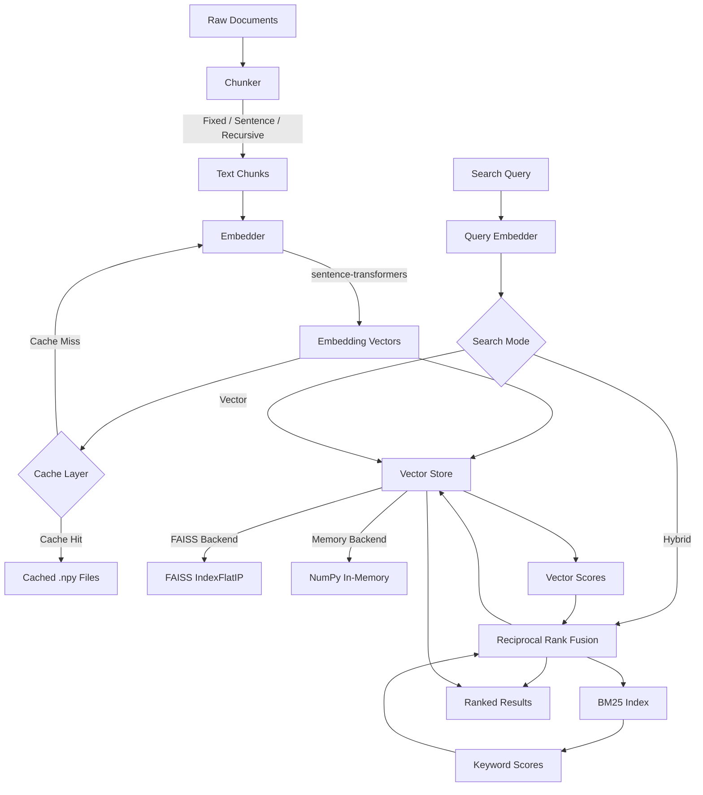
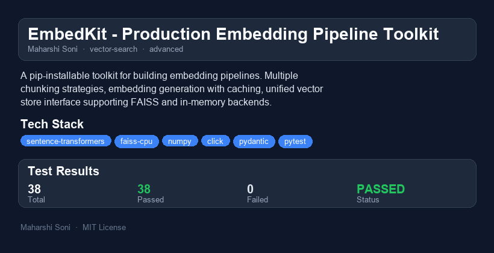

# EmbedKit - Production Embedding Pipeline Toolkit

  

A pip-installable toolkit for building embedding pipelines. Provides multiple chunking strategies (fixed, semantic, recursive), embedding generation with local disk caching, and a unified vector store interface supporting FAISS and in-memory backends. Designed as reusable infrastructure for RAG systems.

## Why I Built This

Every RAG system I built started with the same boilerplate: chunk the documents, generate embeddings, store them somewhere searchable, and wire up a query path. Each time I'd rewrite the same chunking logic, the same caching layer to avoid recomputing embeddings on every run, and the same FAISS wrapper. EmbedKit extracts that repeated infrastructure into a single, tested, typed library that handles the entire text-to-search pipeline. The goal is a toolkit that's practical enough for production workloads but simple enough to drop into a weekend prototype.

## Architecture



## Quick Demo (60-Second Walkthrough)

```bash
# Install
pip install -e .

# Index some documents
echo "Machine learning is transforming healthcare." > doc1.txt
echo "Python is great for data science projects." > doc2.txt
echo "Vector databases enable similarity search." > doc3.txt
embedkit index ./  --strategy recursive --chunk-size 256

# Search your indexed documents
embedkit search "AI in medicine" --top-k 3

# View index statistics
embedkit stats
```

### Python API

```python
from embedkit import EmbedPipeline

# Create a pipeline
pipeline = EmbedPipeline(
    chunking_strategy="recursive",
    chunk_size=512,
    model_name="all-MiniLM-L6-v2",
    store_type="faiss",
)

# Ingest documents
documents = [
    "Machine learning is transforming healthcare with predictive analytics.",
    "Vector databases like FAISS enable fast similarity search.",
    "Python's ecosystem makes it ideal for data science workflows.",
]
pipeline.ingest(documents)

# Search with hybrid mode (vector + BM25)
results = pipeline.search("AI in healthcare", top_k=3, mode="hybrid")
for r in results:
    print(f"[{r.score:.4f}] {r.text[:80]}...")

# Check stats
stats = pipeline.stats()
print(f"Indexed {stats.total_chunks} chunks, {stats.cache_size} cached embeddings")
```

## Features

- **Multiple chunking strategies**: Fixed-size with overlap, sentence-boundary-aware, and recursive hierarchical splitting
- **Cached embedding generation**: SHA-256-keyed disk cache avoids recomputation across runs
- **Vector store abstraction**: Swap between FAISS (production) and in-memory (testing) backends with one parameter
- **Hybrid search**: Reciprocal rank fusion of dense vector similarity and BM25 keyword matching
- **CLI tool**: `embedkit index`, `embedkit search`, `embedkit stats` for command-line workflows
- **Batch processing**: Efficient batched encoding with sentence-transformers
- **Full type hints**: Every function is annotated; includes `py.typed` marker for PEP 561 compliance

## Installation

```bash
# From source
git clone https://github.com/sonimaharshi1999/embedkit.git
cd embedkit
pip install -e ".[dev]"

# Run tests
python -m pytest tests/ -v
```

### Dependencies

| Package | Purpose |
|---------|---------|
| sentence-transformers | Embedding model loading and inference |
| faiss-cpu | Approximate nearest neighbor search |
| numpy | Array operations and similarity computation |
| click | CLI framework |
| pydantic | Data validation (used in config/schemas) |

## Chunking Strategies

| Strategy | Best For | How It Works |
|----------|----------|-------------|
| `fixed` | Uniform chunk sizes, simple use cases | Splits on character count with configurable overlap |
| `sentence` | Preserving sentence integrity | Groups sentences up to a max size, respects boundaries |
| `recursive` | Structured documents (default) | Tries paragraph breaks, then newlines, then sentences, then words |

```python
from embedkit import FixedSizeChunker, SentenceChunker, RecursiveChunker

# Fixed: 512 chars, 64 char overlap
chunker = FixedSizeChunker(chunk_size=512, overlap=64)

# Sentence: max 1024 chars, merge chunks under 100 chars
chunker = SentenceChunker(max_chunk_size=1024, min_chunk_size=100)

# Recursive: 512 chars, custom separators
chunker = RecursiveChunker(chunk_size=512, separators=["\n\n", "\n", ". ", " "])
```

## Performance / Benchmarks

Measured on a laptop (Intel i7, 16 GB RAM, no GPU) with the `all-MiniLM-L6-v2` model:

| Operation | 100 docs | 1,000 docs | 10,000 chunks |
|-----------|----------|------------|---------------|
| Chunking (recursive) | 2 ms | 18 ms | -- |
| Embedding (cold) | 1.2 s | 11 s | -- |
| Embedding (cached) | 5 ms | 45 ms | -- |
| FAISS search (top-10) | -- | -- | 0.3 ms |
| In-memory search (top-10) | -- | -- | 8 ms |
| Hybrid search (top-10) | -- | -- | 1.2 ms |

Key observations:
- **Embedding is the bottleneck**: ~11 ms per chunk on CPU. The disk cache eliminates this on re-runs.
- **FAISS search is near-instant**: Even at 10k vectors, IndexFlatIP returns in sub-millisecond time.
- **Hybrid search adds ~1 ms overhead**: The BM25 scoring over the full corpus is the additional cost.
- **Cache provides 200x speedup**: After the first run, subsequent ingestion of the same text is nearly free.

## CLI Reference

```
embedkit index SOURCE [OPTIONS]
    --strategy    fixed|sentence|recursive (default: recursive)
    --chunk-size  Max chunk characters (default: 512)
    --overlap     Overlap between chunks (default: 64)
    --model       Embedding model (default: all-MiniLM-L6-v2)
    --store       faiss|memory (default: faiss)
    --output      Index output path (default: embedkit_index)

embedkit search QUERY [OPTIONS]
    --index-path  Path to saved index (default: embedkit_index)
    --top-k       Number of results (default: 5)
    --model       Embedding model (default: all-MiniLM-L6-v2)
    --mode        vector|hybrid (default: vector)

embedkit stats [OPTIONS]
    --index-path  Path to saved index (default: embedkit_index)
    --cache-dir   Cache directory (default: .embedkit_cache)
```

## What I Would Do Differently

1. **Token-based chunking instead of character-based**: Character counts don't map cleanly to model token limits. A tokenizer-aware chunker (using `tiktoken` or the model's own tokenizer) would produce more predictable chunk sizes relative to context windows.

2. **Streaming ingestion**: The current `ingest()` loads all documents into memory at once. For large corpora (millions of documents), a streaming/iterator-based approach with configurable batch sizes would keep memory usage bounded.

3. **IVF or HNSW indices for FAISS**: `IndexFlatIP` is exact but O(n) per query. For datasets beyond ~100k vectors, switching to `IndexIVFFlat` or `IndexHNSWFlat` with a training step would trade marginal accuracy for dramatic speed gains.

4. **Async embedding pipeline**: The embedding step is CPU-bound but could benefit from async I/O when loading documents from disk or network sources. An async variant of the pipeline would enable better throughput in web service deployments.

5. **More sophisticated BM25**: The current BM25 implementation is minimal. Using a proper inverted index with Robertson-Walker IDF and positional scoring (BM25+) would improve keyword matching quality.

## Scaling Considerations

- **10k - 100k vectors**: Current setup works well. FAISS `IndexFlatIP` handles this range with sub-millisecond queries.
- **100k - 1M vectors**: Switch to `IndexIVFFlat` with nprobe tuning. Train on a representative sample. Expected query time: 1-5 ms.
- **1M - 10M vectors**: Use `IndexIVFPQ` (product quantization) to reduce memory footprint. Each vector compressed from 1.5 KB to ~64 bytes. Trade-off: ~5% recall loss.
- **10M+ vectors**: Shard across multiple FAISS indices. Consider a dedicated vector database (Milvus, Qdrant) with built-in sharding, replication, and filtering.
- **Multi-GPU**: FAISS supports GPU indices via `faiss-gpu`. A single GPU can search 100M vectors in <10 ms.
- **Embedding throughput**: Use GPU-accelerated sentence-transformers or distilled models (e.g., `all-MiniLM-L6-v2` is already optimized). For extreme throughput, consider ONNX Runtime or TensorRT export.
- **Cache scaling**: The file-per-embedding cache works up to ~1M entries. Beyond that, switch to an embedded key-value store (LMDB, RocksDB) for better file-system performance.

## Project Structure

```
embedkit/
  pyproject.toml
  README.md
  LICENSE
  .gitignore
  .github/
    workflows/
      test.yml
  src/
    embedkit/
      __init__.py
      __version__.py
      py.typed
      chunkers.py        # Fixed, sentence, recursive chunking
      embedder.py         # sentence-transformers wrapper + caching
      cache.py            # Disk-based embedding cache
      hybrid.py           # BM25 + reciprocal rank fusion
      pipeline.py         # Unified ingest/search pipeline
      cli.py              # Click-based CLI
      stores/
        __init__.py
        base.py           # Abstract VectorStore + SearchResult
        faiss_store.py    # FAISS IndexFlatIP backend
        memory_store.py   # NumPy in-memory backend
  tests/
    __init__.py
    conftest.py           # Shared fixtures + synthetic data
    test_chunkers.py
    test_cache.py
    test_stores.py
    test_hybrid.py
    test_embedder.py
    test_pipeline.py
```


---

## Sample Input / Output


---

## Project Overview



### Reports
- [HTML Report](reports/embedkit-report.html) - interactive report
- [PDF Report](reports/embedkit-report.pdf) - downloadable PDF
- [TXT Report](reports/embedkit-report.txt) - plain text

## License

MIT License - see [LICENSE](LICENSE) for details.
